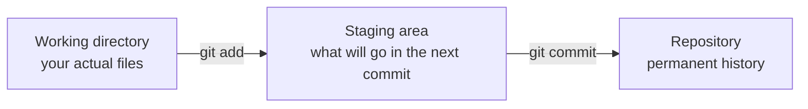
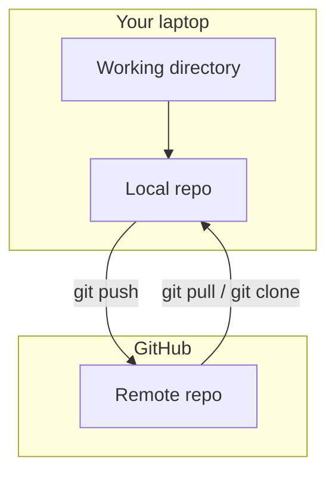

<h1 v-motion :initial="{ x: -60, opacity: 0 }" :enter="{ x: 0, opacity: 1, transition: { duration: 500 } }">
INF 345 — Fundamentals of DevOps
</h1>

<h2 v-motion :initial="{ x: -60, opacity: 0 }" :enter="{ x: 0, opacity: 1, transition: { duration: 500, delay: 150 } }">
Lecture 2: Git & GitHub
</h2>

<div v-motion :initial="{ opacity: 0 }" :enter="{ opacity: 1, transition: { duration: 500, delay: 400 } }" class="pt-8 opacity-70">
Adil Akhmetov · Lesson 2
</div>

---
layout: default
---

# Recap — Lesson 1

<v-clicks>

- What does the **C** in CALMS stand for? <span v-click class="opacity-60">(Culture)</span>
- Name the three modules in this course's toolchain, in order.
  <span v-click class="opacity-60">(Containers → Automation → CI/CD)</span>
- Where does your Lab 01/02 grade actually come from?
  <span v-click class="opacity-60">(RHA lab completion, not GitHub)</span>

</v-clicks>

---

# Today's agenda

<v-clicks>

- [ ] Why version control exists (the problem it solves)
- [ ] Git fundamentals: commits, diffs, history
- [ ] Branching & the GitHub workflow
- [ ] How this course uses GitHub Classroom
- [ ] Where to learn more — curated resources
- [ ] Today's practice session

</v-clicks>

---
layout: center
class: text-center
---

# The scenario

<div class="text-lg text-left mt-4 max-w-2xl mx-auto">

`report_final.docx`, `report_final_v2.docx`,
`report_final_v2_ACTUALLY_FINAL.docx`, `report_final_v2_ACTUALLY_FINAL_fix.docx`.

Two teammates edit the same file. One's changes silently overwrite the
other's. Nobody remembers which version is on the server.

</div>

<div v-click class="mt-8 text-xl font-bold">
Git exists to make this scenario impossible.
</div>

---
layout: section
transition: slide-left
---

# Block 1
## Git fundamentals

---

# Git tracks snapshots, not files

<v-clicks>

- Every commit is a **snapshot** of your whole project at that moment —
  not just a list of changed lines.
- Each commit points to its **parent**, forming a history you can walk
  backwards through.
- Nothing is a commit until you explicitly say so — Git never saves
  automatically.

</v-clicks>

---

# The three states



<div v-click class="mt-6 text-sm opacity-70">
`git add` doesn't save anything permanently — it just marks what you
intend to commit next. This two-step process is why you can commit
exactly the changes you meant to, not everything you touched.
</div>

---

# A commit, edited live

```md {monaco-diff}
# inf345-lab

A student's Ansible playbook for Lab 02.
~~~
# inf345-lab

A student's Ansible playbook for Lab 02.

## Status
Idempotent — verified with a second run.
```

<div class="mt-4 text-sm opacity-70">
This is what `git diff` shows you before you commit: exactly what changed,
line by line. Edit either panel — the diff updates live.
</div>

---

# The core loop

```bash {1|2|3|4|all}
git status
git add README.md
git commit -m "Document idempotence check"
git log --oneline
```

<div v-click class="mt-6 text-sm opacity-70">
This four-command loop is 90% of what you'll do with Git day to day.
Everything else — branches, remotes, rebasing — builds on top of it.
</div>

---
layout: center
class: text-center
---

# Quick check

<div class="text-xl mt-4">
Why does Git separate "staging" from "committing" instead of just
committing everything you've changed?
</div>

<div v-click class="mt-8 text-lg opacity-70">
So you can commit a coherent, reviewable unit of change — not an
accidental mix of unrelated edits.
</div>

---
layout: section
transition: slide-left
---

# Block 2
## Branching & the GitHub workflow

---

# Local vs remote



<div class="mt-6 text-sm opacity-70">
Git itself is fully local and works with no internet connection. GitHub is
just a hosted remote — a shared place everyone pushes to and pulls from.
</div>

---

# Branches are just pointers

<v-clicks>

- A branch is a lightweight, movable pointer to a commit — not a copy of
  the whole project.
- `main` is just a convention for "the default branch," not a special
  technical concept.
- Creating a branch is instant because it doesn't duplicate any files.

</v-clicks>

<div v-click class="mt-6 p-4 rounded bg-blue-500/10 text-sm">
For this course: you generally won't need branches for labs — you'll work
directly on <code>main</code> in your Classroom repo. Branches matter more
once you're collaborating with others, which is why the capstone uses them.
</div>

---

# The GitHub Classroom flow

```bash {1|2|3-4|5|all}
# 1. Accept the assignment invite in your browser — GitHub creates your repo
git clone <your-repo-url>
cd <your-repo>
# ... do the work ...
git add . && git commit -m "Complete practice exercise" && git push
```

<div v-click class="mt-6 text-sm opacity-70">
That last line is what triggers the autograder. Every lab and practice
session in this course follows this exact same loop.
</div>

---
layout: section
transition: slide-left
---

# Block 3
## Where to learn more

---

# Curated resources

<div class="grid grid-cols-2 gap-x-8 gap-y-4 text-sm mt-4">
<div class="flex items-start gap-3"><logos-git-icon class="text-2xl mt-1 flex-shrink-0" /><div><b>Pro Git</b> (free book) <br/><code>git-scm.com/book</code></div></div>
<div class="flex items-start gap-3"><logos-github-icon class="text-2xl mt-1 flex-shrink-0" /><div><b>GitHub Skills</b> (interactive) <br/><code>skills.github.com</code></div></div>
<div class="flex items-start gap-3"><span class="text-2xl mt-1">🌳</span><div><b>Learn Git Branching</b> (visual, interactive) <br/><code>learngitbranching.js.org</code></div></div>
<div class="flex items-start gap-3"><span class="text-2xl mt-1">📘</span><div><b>Atlassian Git Tutorials</b> <br/><code>atlassian.com/git/tutorials</code></div></div>
<div class="flex items-start gap-3"><span class="text-2xl mt-1">🆘</span><div><b>Oh Shit, Git!?!</b> (fixing mistakes) <br/><code>ohshitgit.com</code></div></div>
</div>

<div class="mt-6 text-sm opacity-70">Bookmark these — you'll come back to them all semester, not just today.</div>

---

# Today's practice session — 1 hour

<v-clicks>

- [ ] Accept the practice repo invite (link posted separately)
- [ ] Clone it, make the required commits, push
- [ ] Autograder checks your commit history and final file state
- [ ] Submit before the session ends — this is also your attendance signal

</v-clicks>

<div v-click class="mt-6 text-sm opacity-70">
See <code>practices/02-git-github/README.md</code> for the exact task and
definition of done.
</div>

---
layout: default
---

# Before next lecture

<div class="flex items-center gap-3"><logos-docker-icon class="text-2xl" /><span>Lesson 3 is Containers 101 — come with these ready:</span></div>

- [ ] Install Docker Desktop **or** Podman Desktop on your laptop
- [ ] Make sure today's practice session is pushed and green
- [ ] Skim `labs/01-containers-podman/README.md`

---
layout: end
---

# See you next lecture

Containers 101 — why they exist, and how to build your first one.
