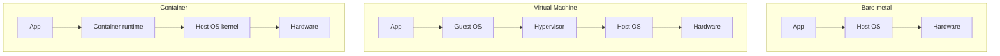
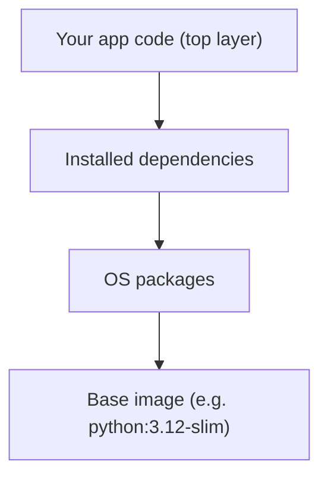

# INF 345 — Fundamentals of DevOps

## Lecture 3: Containers 101 — Why & How

<div class="pt-8 opacity-70">
Adil Akhmetov · Lesson 3
</div>

---
layout: default
---

# Recap — Lesson 2 (Git & GitHub)

<v-clicks>

- What command creates a new commit from staged changes? <span v-click class="opacity-60">(`git commit`)</span>
- How do you submit a lab in this course? <span v-click class="opacity-60">(push to your GitHub Classroom repo)</span>
- How fast do you get feedback on a lab submission?
  <span v-click class="opacity-60">(Minutes — via GitHub Actions autograding)</span>

</v-clicks>

---
---

# Today's agenda

<v-clicks>

- [ ] Why containers exist (the problem they solve)
- [ ] Processes vs VMs vs containers
- [ ] Images, layers, and the Containerfile
- [ ] Podman vs Docker
- [ ] Live demo → straight into Lab 01

</v-clicks>

---
layout: center
class: text-center
---

# The scenario

<div class="text-lg text-left mt-4 max-w-2xl mx-auto">

You write a Python app. It runs perfectly on your laptop. You hand it to a
teammate — or deploy it to a server — and it crashes: wrong Python
version, a missing system library, a config file that only exists on your
machine.

</div>

<div v-click class="mt-8 text-xl font-bold">
Containers exist to make this scenario impossible.
</div>

---
layout: section
transition: slide-left
---

# Block 1
## Processes, VMs, and Containers

---
---

# Three ways to isolate an app



---
---

# The key insight

<v-clicks>

- A **VM** virtualizes hardware — every VM ships a full guest OS. Heavy,
  slow to boot (minutes), strongly isolated.
- A **container** shares the host's kernel and isolates everything else
  (filesystem, processes, network) using Linux namespaces & cgroups. Light,
  boots in milliseconds, less isolated than a VM.

</v-clicks>

<div v-click class="mt-8 p-4 rounded bg-blue-500/10 text-sm">
You don't need to understand namespaces/cgroups internals for this course —
just this: a container is a normal process on your machine that <i>thinks</i>
it has its own filesystem and network stack.
</div>

---
layout: center
class: text-center
---

# Quick check

<div class="text-xl mt-4">
Why do containers start so much faster than VMs?
</div>

<div v-click class="mt-8 text-lg opacity-70">
No guest OS to boot — you're just starting a process against a kernel
that's already running.
</div>

---
layout: section
transition: slide-left
---

# Block 2
## Images, layers, and the Containerfile

---
---

# Image vs container

<v-clicks>

- An **image** is a read-only template — like a class, or a recipe.
- A **container** is a running instance of that image — like an object, or
  the meal you actually cooked.
- You can run many containers from one image, each isolated from the
  others.

</v-clicks>

---
---

# Images are built from layers



<div v-click class="mt-6 text-sm opacity-70">
Layers are cached. Change only your app code, and rebuilding reuses every
layer below it — this is why build order in a Containerfile matters.
</div>

---
---

# Anatomy of a Containerfile

```dockerfile {1|2|3-5|6|7|8-9}
FROM python:3.12-slim
RUN useradd -m appuser
WORKDIR /app
COPY app/requirements.txt .
RUN pip install -r requirements.txt
COPY app/ .
EXPOSE 8080
USER appuser
CMD ["python", "app.py"]
```

<div class="mt-2 text-sm opacity-70" v-click="6">
Click through: base image → create a non-root user → set up the working
dir and install deps → copy in the app → expose the port → switch to the
non-root user before the final command.
</div>

<div class="mt-4 text-sm opacity-70">
Notice the requirements file is copied and installed <i>before</i> the rest
of the app — so editing app code doesn't invalidate the dependency-install
layer's cache.
</div>

---
---

# The non-root rule

<v-clicks>

- By default, a container's main process runs as **root** inside the
  container.
- "It's just a container" is not a good enough reason — a container escape
  or a mounted volume can turn that into real host access.
- Fix: create a non-root user and `USER` to it before the final `CMD`, like
  the last step of the Containerfile above.
- This is exactly what Lab 01's autograder checks for.

</v-clicks>

---
layout: section
transition: slide-left
---

# Block 3
## Podman vs Docker, and today's lab

---
---

# Podman vs Docker

<div class="flex items-center gap-6 mb-4">
<logos-docker-icon class="text-4xl" />
<span class="text-2xl opacity-50">vs</span>
<simple-icons-podman class="text-4xl" style="color:#892CA0" />
</div>

| | Docker | Podman |
|---|---|---|
| Architecture | Client talks to a background **daemon** | **Daemonless** — runs directly as your user |
| Root by default | Yes (historically) | **No** — rootless by default |
| Commands | `docker build`, `docker run`, ... | `podman build`, `podman run`, ... (same syntax) |
| Compose | `docker compose` | `podman-compose` (drop-in) |

<div class="mt-6 text-sm opacity-70">
Everything you write today — the Containerfile itself — is identical
either way. This is the FOSS-equivalence called out in Lab 01's README.
</div>

---
---

# Live demo — build, run, verify

```bash{1|2-3|4-5|all}
cd labs/01-containers-podman
podman build -t lab01-submission ./submission
# → builds the image from your Containerfile
podman run --rm -p 8080:8080 lab01-submission
curl localhost:8080
# → should return: "hello from inf345 lab01"
```

<div v-click class="mt-6 text-sm opacity-70">
This is literally Lab 01's quickstart — you're not starting from a blank
page today, you're finishing what's already scaffolded.
</div>

---
---

# Lab 01 — definition of done

<v-clicks>

- [ ] `podman build` succeeds with no errors
- [ ] `podman run` starts the container and it responds on port 8080
- [ ] `hadolint` reports no errors on your Containerfile
- [ ] Container does **not** run as root
- [ ] Autograder passes on your final push

</v-clicks>

---
layout: default
---

# Before next lecture

- [ ] Finish Lab 01's Containerfile locally and confirm it builds & runs
- [ ] Push it to your GitHub Classroom repo (practice/portfolio — ungraded)
- [ ] Start the real RHA DO188 lab on rha.ole.redhat.com — **this is what
      gets graded**

<div class="mt-8 text-sm opacity-60">
Lab 01 is due Week 6 — you have time, but starting now means the RHA lab
content will already feel familiar instead of brand new.
</div>

---
layout: end
---

# Next lecture

Images, layers, and multi-stage builds — making your images smaller and
your builds faster.
